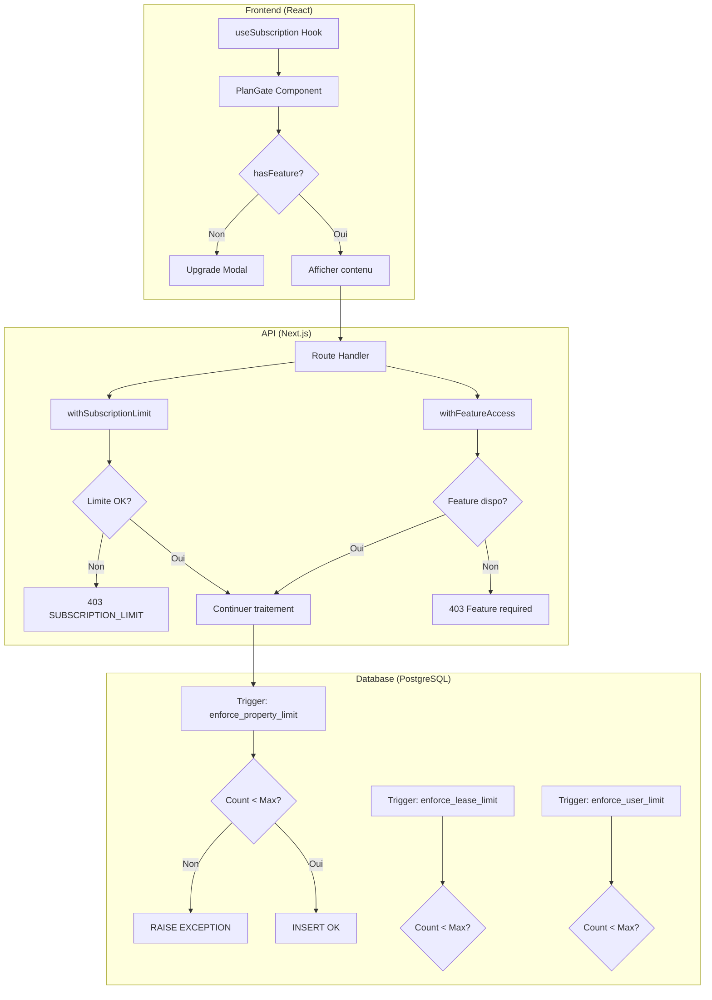
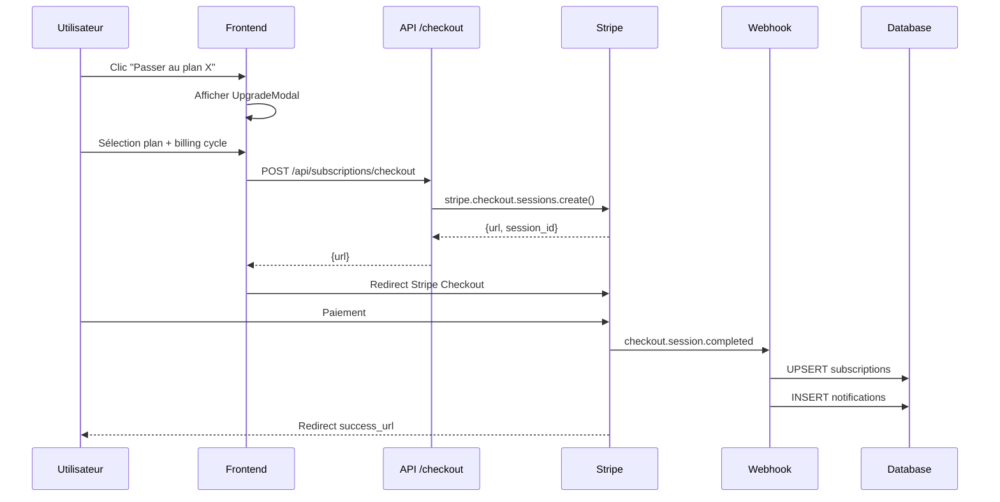
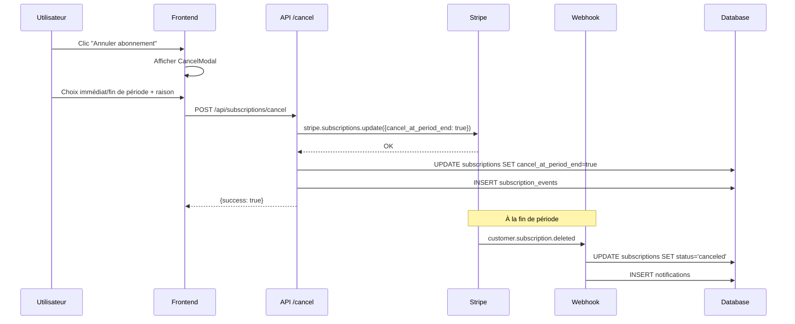

# AUDIT COMPLET DU SYSTÈME DE BILLING TALOK

**Date :** Janvier 2026
**Version :** SOTA 2026
**Auditeur :** Claude (Expert SaaS & Billing)

---

## RÉSUMÉ EXÉCUTIF

### Vue d'ensemble

Talok dispose d'un système de billing **mature et bien structuré** basé sur Stripe, avec une architecture multi-couche (Frontend + Backend + Base de données) pour la gestion des restrictions.

### Points forts
- **Architecture solide** : Vérification des limites à 3 niveaux (middleware API, triggers DB, composants React)
- **Grille tarifaire claire** : 8 forfaits bien différenciés (Gratuit → Enterprise XL)
- **Intégration Stripe complète** : Webhooks, Billing Portal, Checkout Sessions
- **Marge saine** : 40-55% de marge moyenne sur les revenus

### Points critiques identifiés
1. **⚠️ CRITIQUE** : Certaines routes API ne vérifient pas les limites d'abonnement
2. **⚠️ CRITIQUE** : Pas de tests automatisés pour le système de subscription
3. **🔧 MOYEN** : Logique de downgrade incomplète (données excédentaires)
4. **🔧 MOYEN** : Gestion dunning (échecs de paiement) basique
5. **💡 MINEUR** : Pas de gestion TVA DOM-TOM explicite

### Métriques clés

| Métrique | Valeur |
|----------|--------|
| Forfaits disponibles | 8 (Gratuit → Enterprise XL) |
| Prix mensuel min/max | 0€ / 799€ |
| Features gérées | 24 |
| Routes API protégées | ~5 sur ~265 POST routes |
| Tests automatisés billing | 0 |

---

## 1. CARTOGRAPHIE DES FORFAITS

### 1.1 Tableau comparatif complet

| Forfait | Prix/mois | Prix/an | Biens | Baux | Utilisateurs | Signatures/mois | Stockage |
|---------|-----------|---------|-------|------|--------------|-----------------|----------|
| **Gratuit** | 0€ | 0€ | 1 | 1 | 1 | 0 | 100 Mo |
| **Starter** | 9€ | 90€ (-17%) | 3 | 5 | 1 | 0 | 1 Go |
| **Confort** ⭐ | 35€ | 336€ (-20%) | 10 | 25 | 2 | 2 | 5 Go |
| **Pro** | 69€ | 662€ (-20%) | 50 | ∞ | 5 | 10 | 30 Go |
| **Enterprise S** | 249€ | 2390€ (-20%) | 100 | ∞ | ∞ | 25 | 50 Go |
| **Enterprise M** | 349€ | 3350€ (-20%) | 200 | ∞ | ∞ | 40 | 100 Go |
| **Enterprise L** ⭐ | 499€ | 4790€ (-20%) | 500 | ∞ | ∞ | 60 | 200 Go |
| **Enterprise XL** | 799€ | 7670€ (-20%) | ∞ | ∞ | ∞ | ∞ | ∞ |

### 1.2 Prix des biens supplémentaires

| Forfait | Prix/bien suppl. |
|---------|-----------------|
| Gratuit | Non disponible |
| Starter | 3€/mois |
| Confort | 2,50€/mois |
| Pro | 2€/mois |
| Enterprise | Inclus dans la tranche |

### 1.3 Prix des signatures hors quota

| Forfait | Prix/signature |
|---------|---------------|
| Gratuit | 5,90€ |
| Starter | 4,90€ |
| Confort | 3,90€ |
| Pro | 2,50€ |
| Enterprise S/M/L | 1,90€ |
| Enterprise XL | Inclus |

*Coût Yousign : ~1,50€/signature → Marge 21-74%*

### 1.4 Réductions GLI par forfait

| Forfait | Réduction GLI |
|---------|--------------|
| Gratuit | 0% |
| Starter | -5% |
| Confort | -10% |
| Pro | -15% |
| Enterprise S | -18% |
| Enterprise M | -20% |
| Enterprise L | -22% |
| Enterprise XL | -25% |

### 1.5 Matrice des fonctionnalités

| Fonctionnalité | Gratuit | Starter | Confort | Pro | Enterprise |
|----------------|---------|---------|---------|-----|------------|
| Génération bail | ✅ | ✅ | ✅ | ✅ | ✅ |
| Quittances PDF | ✅ | ✅ | ✅ | ✅ | ✅ |
| Portail locataire | Basique | Basique | Avancé | Complet | Complet |
| Paiement en ligne | ❌ | ✅ | ✅ | ✅ | ✅ |
| **Signature électronique** | ❌ | ❌ | ✅ | ✅ | ✅ |
| **Open Banking** | ❌ | ❌ | ✅ | ✅ | ✅ |
| Rapprochement bancaire | ❌ | ❌ | ✅ | ✅ | ✅ |
| Relances auto (email) | ❌ | Basique | ✅ | ✅ | ✅ |
| **Relances SMS** | ❌ | ❌ | ❌ | ✅ | ✅ |
| Révision IRL auto | ❌ | ❌ | ✅ | ✅ | ✅ |
| **Multi-utilisateurs** | ❌ | ❌ | ✅ (2) | ✅ (5) | ✅ (∞) |
| Colocation | ❌ | ❌ | ✅ | ✅ | ✅ |
| **Scoring IA** | ❌ | ❌ | ✅ | ✅ | ✅ |
| **EDL numérique** | ❌ | ❌ | ✅ | ✅ | ✅ |
| Ordres de travaux | ❌ | ❌ | ✅ | ✅ | ✅ |
| Gestion prestataires | ❌ | ❌ | ❌ | ✅ | ✅ |
| **API Access** | ❌ | ❌ | ❌ | R/W | Full |
| **Webhooks** | ❌ | ❌ | ❌ | ❌ | ✅ |
| **White Label** | ❌ | ❌ | ❌ | ❌ | ✅ (M+) |
| Custom Domain | ❌ | ❌ | ❌ | ❌ | ✅ (L+) |
| **SSO** | ❌ | ❌ | ❌ | ❌ | ✅ (XL) |
| **Module Copro** | ❌ | ❌ | ❌ | ❌ | ✅ (L+) |
| Account Manager | ❌ | ❌ | ❌ | ❌ | Partagé/Dédié |
| SLA garanti | ❌ | ❌ | ❌ | ❌ | 99-99.9% |

### 1.6 Public cible par forfait

| Forfait | Public cible |
|---------|-------------|
| Gratuit | Découverte, 1er bien |
| Starter | Petits propriétaires (1-3 biens) |
| Confort | Propriétaires actifs (3-10 biens) |
| Pro | Gestionnaires/SCI (10-50 biens) |
| Enterprise S | Agences débutantes (50-100 biens) |
| Enterprise M | Agences confirmées (100-200 biens) |
| Enterprise L | Grandes agences (200-500 biens) |
| Enterprise XL | Groupes immobiliers (500+ biens) |

---

## 2. SYSTÈME DE RESTRICTIONS

### 2.1 Architecture du système de restrictions



### 2.2 Où sont définies les limites ?

| Emplacement | Fichier | Description |
|-------------|---------|-------------|
| **Code TypeScript** | `lib/subscriptions/plans.ts` | Définition complète des 8 plans avec limites |
| **Code TypeScript** | `lib/subscriptions/pricing-config.ts` | Prix, quotas signatures, frais |
| **Base de données** | `subscription_plans` | Table synchronisée avec le code |
| **Base de données** | `subscriptions` | Abonnement actif de chaque owner |

### 2.3 Vérification des restrictions - Backend

**Middleware principal** : `lib/middleware/subscription-check.ts`

```typescript
// Vérification des limites quantitatives
export async function withSubscriptionLimit(
  ownerId: string,
  limitType: "properties" | "leases" | "users" | "documents_gb" | "signatures"
): Promise<LimitCheckResult>

// Vérification des features
export async function withFeatureAccess(
  ownerId: string,
  feature: FeatureKey
): Promise<FeatureCheckResult>
```

**Types de limites gérées** :
- `properties` : Nombre de biens
- `leases` : Nombre de baux
- `users` : Nombre d'utilisateurs (team members)
- `documents_gb` : Stockage en Go
- `signatures` : Signatures mensuelles

**Résultat retourné** :
```typescript
{
  allowed: boolean;
  current: number;
  max: number;
  remaining: number;
  plan: string;
  message?: string; // Message d'erreur localisé
}
```

### 2.4 Vérification des restrictions - Database Triggers

**Fichier** : `supabase/migrations/20260110500000_subscription_limits_enforcement.sql`

| Trigger | Table | Action |
|---------|-------|--------|
| `check_property_limit_before_insert` | `properties` | Bloque INSERT si limite atteinte |
| `check_lease_limit_before_insert` | `leases` | Bloque INSERT si limite atteinte |
| `check_user_limit_before_insert` | `team_members` | Bloque INSERT si limite atteinte |

**Fonction SQL** :
```sql
CREATE OR REPLACE FUNCTION enforce_property_limit()
RETURNS TRIGGER AS $$
DECLARE
  current_count INTEGER;
  max_allowed INTEGER;
BEGIN
  -- Récupérer le compteur et la limite du plan
  SELECT s.properties_count, sp.max_properties
  INTO current_count, max_allowed
  FROM subscriptions s
  LEFT JOIN subscription_plans sp ON sp.slug = s.plan_slug
  WHERE s.owner_id = NEW.owner_id;

  -- Vérifier la limite (sauf illimité = -1)
  IF max_allowed != -1 AND current_count >= max_allowed THEN
    RAISE EXCEPTION 'SUBSCRIPTION_LIMIT_REACHED: Limite atteinte';
  END IF;

  RETURN NEW;
END;
$$ LANGUAGE plpgsql;
```

### 2.5 Gestion des dépassements

| Type | Comportement | Message |
|------|------------|---------|
| **Hard limit (backend)** | Blocage immédiat | "Limite de X bien(s) atteinte pour le forfait Y" |
| **Hard limit (DB)** | Erreur SQL P0001 | "SUBSCRIPTION_LIMIT_REACHED" |
| **Soft limit** | ❌ Non implémenté | - |

**Constat** : Talok utilise uniquement des **hard limits**. Pas de soft limit avec grâce.

### 2.6 Messages d'erreur et UX

**Backend** :
```json
{
  "error": "SUBSCRIPTION_LIMIT",
  "message": "Limite de 3 bien(s) atteinte pour le forfait \"starter\". Passez à un forfait supérieur.",
  "details": { "current": 3, "max": 3, "remaining": 0, "plan": "starter" },
  "upgrade_url": "/settings/billing"
}
```

**Frontend (PlanGate)** :
- Mode `block` : Overlay opaque avec message + bouton upgrade
- Mode `blur` : Contenu flouté + overlay
- Mode `hide` : Contenu masqué complètement
- Mode `badgeOnly` : Badge indiquant le plan requis

### 2.7 Feature flags

**Implémentation** : Pas de système de feature flags externe (LaunchDarkly, etc.)

Les features sont **hard-codées** dans `plans.ts` :
```typescript
features: {
  signatures: true,
  open_banking: true,
  scoring_tenant: true,
  // ...
}
```

**Avantage** : Simple, pas de dépendance externe
**Inconvénient** : Déploiement requis pour changer une feature

---

## 3. VÉRIFICATION DES FONCTIONNALITÉS PAR FORFAIT

### 3.1 Mapping fonctionnalité → plan minimum

| Feature | Plan minimum | Fichier de définition |
|---------|-------------|----------------------|
| `signatures` | Confort | `plans.ts` L275 |
| `open_banking` | Confort | `plans.ts` L278 |
| `bank_reconciliation` | Confort | `plans.ts` L279 |
| `auto_reminders` | Starter (basique) / Confort (complet) | `plans.ts` L220/280 |
| `auto_reminders_sms` | Pro | `plans.ts` L348 |
| `scoring_tenant` | Confort | `plans.ts` L297 |
| `edl_digital` | Confort | `plans.ts` L298 |
| `multi_users` | Confort | `plans.ts` L291 |
| `work_orders` | Confort | `plans.ts` L293 |
| `providers_management` | Pro | `plans.ts` L363 |
| `api_access` | Pro | `plans.ts` L365 |
| `webhooks` | Enterprise S | `plans.ts` L440 |
| `white_label` | Enterprise M | `plans.ts` L524 |
| `custom_domain` | Enterprise L | `plans.ts` L610 |
| `sso` | Enterprise XL | `plans.ts` L695 |
| `copro_module` | Enterprise L | `plans.ts` L615 |

### 3.2 Protection Frontend

**Composant principal** : `components/subscription/plan-gate.tsx`

**Utilisation** :
```tsx
<PlanGate feature="scoring_tenant">
  <ScoringDashboard />
</PlanGate>
```

**Fichiers utilisant PlanGate** (15 trouvés) :
- `app/owner/analytics/AnalyticsGate.tsx`
- `app/owner/copro/CoproGate.tsx`
- `app/owner/indexation/IndexationGate.tsx`
- `app/owner/inspections/InspectionsClient.tsx`
- `app/owner/leases/new/ColocationConfig.tsx`
- `app/owner/money/MoneyClient.tsx`
- `app/owner/providers/page.tsx`
- `app/owner/work-orders/page.tsx`
- `components/scoring/ScoringDashboard.tsx`
- `features/finance/components/connected-accounts-list.tsx`
- Et autres...

### 3.3 Protection Backend

**Routes API avec protection subscription** :

| Route | Protection | Type |
|-------|-----------|------|
| `POST /api/properties` | ✅ `withSubscriptionLimit(profile.id, "properties")` | Limite |
| `POST /api/leases` | ✅ `withSubscriptionLimit(profileData.id, "leases")` | Limite |
| Autres routes | ⚠️ **NON PROTÉGÉES** | - |

### 3.4 ⚠️ FAILLES POTENTIELLES IDENTIFIÉES

**Routes POST sans vérification de subscription** (~260 routes) :

| Route | Risque | Recommandation |
|-------|--------|---------------|
| `POST /api/signatures/requests` | 🔴 Élevé | Vérifier quota signatures |
| `POST /api/team_members` | 🔴 Élevé | Vérifier limite users |
| `POST /api/documents/upload` | 🟡 Moyen | Vérifier stockage |
| `POST /api/invoices` | 🟡 Moyen | Vérifier feature |
| `POST /api/work-orders` | 🟢 Faible | Feature check |
| `POST /api/providers` | 🟢 Faible | Feature check |

### 3.5 Matrice de protection

| Feature | Frontend (PlanGate) | Backend (API) | Database (Trigger) |
|---------|---------------------|---------------|-------------------|
| **Ajout propriété** | ✅ UsageLimitBanner | ✅ withSubscriptionLimit | ✅ enforce_property_limit |
| **Ajout bail** | ✅ UsageLimitBanner | ✅ withSubscriptionLimit | ✅ enforce_lease_limit |
| **Ajout utilisateur** | ✅ PlanGate | ❌ **MANQUANT** | ✅ enforce_user_limit |
| **Signature** | ✅ SignatureUsageBadge | ❌ **MANQUANT** | ❌ Pas de trigger |
| **Scoring IA** | ✅ PlanGate | ❌ **MANQUANT** | ❌ |
| **Open Banking** | ✅ PlanGate | ❌ **MANQUANT** | ❌ |
| **API Access** | N/A | Via API Key check | ❌ |

---

## 4. LOGIQUE UPGRADE / DOWNGRADE

### 4.1 Flux d'upgrade



### 4.2 Parcours utilisateur upgrade

1. **Déclencheur** :
   - Clic sur bouton "Upgrade" dans settings
   - Clic sur contenu bloqué par PlanGate
   - Limite atteinte (banner)

2. **Modal d'upgrade** (`upgrade-modal.tsx`) :
   - Affiche les plans disponibles (> plan actuel)
   - Toggle mensuel/annuel (-17% affiché)
   - Liste des features gagnées
   - CTA "1er mois offert" (trial)

3. **Checkout Stripe** :
   - Payment methods : Card, SEPA Direct Debit
   - Allow promotion codes : ✅
   - Trial : 30 jours (nouveaux clients uniquement)
   - Locale : FR

4. **Post-paiement** :
   - Webhook met à jour `subscriptions`
   - Notification "Abonnement activé !"
   - Redirect vers `/owner/settings/billing?success=true`

### 4.3 Flux de downgrade



### 4.4 Gestion du prorata

**Implémentation** : Délégué à Stripe

Stripe gère automatiquement :
- Prorata à l'upgrade (facturation immédiate de la différence)
- Crédit au downgrade (appliqué sur prochaine facture)

### 4.5 ⚠️ Problème : Données excédentaires au downgrade

**Situation** : Utilisateur Pro (50 biens) → Confort (10 biens)

**État actuel** : ❌ **Aucune gestion**

Le code ne vérifie pas si l'utilisateur a plus de données que la nouvelle limite permet.

**Comportement observé** :
- L'utilisateur garde ses 50 biens
- Il ne peut plus en ajouter (trigger bloque)
- Mais les biens existants restent accessibles

**Recommandation** : Implémenter une des stratégies suivantes :
1. **Blocage** : Refuser le downgrade si données > limite
2. **Archivage** : Archiver les données excédentaires
3. **Read-only** : Données excédentaires en lecture seule
4. **Période de grâce** : 30 jours pour réduire

### 4.6 Période de grâce

**État actuel** : ❌ **Non implémentée**

Le passage au plan inférieur est :
- Immédiat si `immediately: true`
- À la fin de période sinon (`cancel_at_period_end: true`)

### 4.7 Notifications

| Événement | Notification | Email |
|-----------|-------------|-------|
| Subscription créée | ✅ In-app | ❌ |
| Subscription annulée | ✅ In-app | ❌ |
| Paiement échoué | ✅ In-app | ❌ |
| Renouvellement | ❌ | ❌ |
| Fin de trial | ❌ | ❌ |

---

## 5. SYSTÈME DE PAIEMENT

### 5.1 Provider : Stripe

**Mode d'intégration** : SDK Stripe + Checkout Sessions

**Configuration** :
```typescript
// lib/stripe/index.ts
import Stripe from 'stripe';
export const stripe = new Stripe(process.env.STRIPE_SECRET_KEY!, {
  apiVersion: '2023-10-16',
});
```

**Credentials** :
- Stockés en base (Admin > Intégrations) avec fallback sur env vars
- `STRIPE_SECRET_KEY`
- `STRIPE_WEBHOOK_SECRET`

### 5.2 Abonnements récurrents

**Création** :
```typescript
// app/api/subscriptions/checkout/route.ts
stripe.checkout.sessions.create({
  mode: "subscription",
  payment_method_types: ["card", "sepa_debit"],
  subscription_data: {
    trial_period_days: existingSub ? undefined : 30,
  },
  allow_promotion_codes: true,
});
```

**Modes supportés** :
- Mensuel (`monthly`)
- Annuel (`yearly`) avec -20% de réduction

### 5.3 Webhooks implémentés

| Event Stripe | Handler | Action |
|-------------|---------|--------|
| `checkout.session.completed` | `handleCheckoutCompleted` | Crée/MAJ subscription, notification |
| `customer.subscription.created` | `handleSubscriptionUpdated` | MAJ subscription |
| `customer.subscription.updated` | `handleSubscriptionUpdated` | MAJ dates, status, cancel_at_period_end |
| `customer.subscription.deleted` | `handleSubscriptionDeleted` | Status → canceled, notification |
| `invoice.paid` | `handleInvoicePaid` | Enregistre facture dans `subscription_invoices` |
| `invoice.payment_failed` | `handleInvoiceFailed` | Status → past_due, notification |

### 5.4 Gestion des échecs de paiement (Dunning)

**État actuel** : ⚠️ **Basique**

| Action | Implémenté |
|--------|-----------|
| Détection échec | ✅ `invoice.payment_failed` |
| Statut `past_due` | ✅ |
| Notification in-app | ✅ |
| Email de relance | ❌ |
| Retry automatique | ❌ (délégué à Stripe Smart Retries) |
| Suspension après X échecs | ❌ |
| Blocage fonctionnalités | ❌ |

**Recommandation** : Configurer Stripe Dunning et ajouter des emails de relance.

### 5.5 Factures et conformité

**Stockage factures** :
```sql
-- Table subscription_invoices
stripe_invoice_id, amount_due, amount_paid, status,
hosted_invoice_url, invoice_pdf,
period_start, period_end, paid_at
```

**Conformité française** :
| Élément | Statut |
|---------|--------|
| Numéro séquentiel | ✅ Géré par Stripe |
| Mentions légales | ✅ Stripe Invoice |
| TVA 20% | ✅ Configuré Stripe |
| TVA DOM-TOM | ⚠️ **Non configuré** |
| Archivage 10 ans | ❓ Dépend config Stripe |

### 5.6 Gestion TVA

**État actuel** : TVA France métropolitaine (20%) par défaut Stripe

**DOM-TOM** : ❌ Pas de gestion spécifique
- Martinique, Guadeloupe, Réunion : TVA 8.5%
- Guyane, Mayotte : Pas de TVA

### 5.7 Remboursements

**Implémenté** dans `stripe.service.ts` :
```typescript
export async function createRefund(
  paymentIntentId: string,
  amount?: number,
  reason?: "duplicate" | "fraudulent" | "requested_by_customer"
)
```

**Utilisation** : Via admin uniquement (pas d'API utilisateur).

### 5.8 Mode test vs production

**Détection** :
```typescript
const isTestMode = process.env.STRIPE_SECRET_KEY?.startsWith('sk_test');
```

**Séparation** : Même code, clés différentes par environnement.

### 5.9 Frais de paiement (tenant payments)

| Méthode | Frais facturés | Coût Stripe | Marge |
|---------|---------------|-------------|-------|
| CB Standard | 2.2% | 1.5% + 0.25€ | ~31% |
| CB Enterprise | 1.9% | 1.5% + 0.25€ | ~21% |
| SEPA Standard | 0.50€ | 0.35€ | 30% |
| SEPA Enterprise | 0.40€ | 0.35€ | 12.5% |
| Virement | Gratuit | 0€ | - |

---

## 6. RECOMMANDATIONS

### 6.1 ⚠️ Problèmes critiques

#### CRIT-01 : Routes API non protégées
**Risque** : Accès non autorisé à des fonctionnalités premium
**Impact** : Perte de revenus, abus
**Solution** : Ajouter `withFeatureAccess()` ou `withSubscriptionLimit()` sur toutes les routes sensibles

**Routes à protéger en priorité** :
```typescript
// /api/signatures/requests/route.ts
const limitCheck = await withSubscriptionLimit(profileId, "signatures");
if (!limitCheck.allowed) {
  return createSubscriptionErrorResponse(limitCheck);
}

// /api/team_members/route.ts (si existe)
const limitCheck = await withSubscriptionLimit(ownerId, "users");
```

#### CRIT-02 : Absence de tests automatisés
**Risque** : Régression non détectée sur le billing
**Impact** : Facturation incorrecte, accès non autorisé
**Solution** : Créer une suite de tests

```typescript
// tests/subscription.spec.ts
describe('Subscription limits', () => {
  it('should block property creation when limit reached', async () => {
    // Setup: user with starter plan (3 properties max)
    // Create 3 properties
    // Attempt to create 4th
    // Assert: 403 SUBSCRIPTION_LIMIT_REACHED
  });

  it('should allow property creation on upgrade', async () => {
    // Upgrade to Confort
    // Create 4th property
    // Assert: 201 Created
  });
});
```

#### CRIT-03 : Pas de gestion des données excédentaires au downgrade
**Risque** : Incohérence données/forfait
**Solution** : Vérifier avant downgrade + stratégie de gestion

### 6.2 🔧 Améliorations techniques

#### TECH-01 : Centraliser la vérification des features
Créer un middleware unifié pour toutes les routes API :
```typescript
// lib/middleware/require-subscription.ts
export function requireFeature(feature: FeatureKey) {
  return async (req: Request, profileId: string) => {
    const check = await withFeatureAccess(profileId, feature);
    if (!check.allowed) {
      throw new SubscriptionError(check.message, check.requiredPlan);
    }
  };
}
```

#### TECH-02 : Améliorer le dunning
- Configurer les Smart Retries Stripe
- Emails de relance J+1, J+3, J+7
- Dégradation progressive des fonctionnalités
- Suspension après 14 jours d'impayé

#### TECH-03 : Ajouter des métriques
```typescript
// Tracking subscription events
analytics.track('subscription_upgraded', {
  from_plan: 'starter',
  to_plan: 'confort',
  billing_cycle: 'yearly',
  mrr_delta: 2600, // centimes
});
```

#### TECH-04 : Implémenter les feature flags
Utiliser un service externe (LaunchDarkly, Flagsmith) pour :
- A/B testing pricing
- Rollout progressif de features
- Kill switch

### 6.3 💡 Optimisations business/UX

#### BIZ-01 : Emails transactionnels
| Email | Priorité |
|-------|----------|
| Bienvenue + activation | Haute |
| Fin de trial J-7 | Haute |
| Fin de trial J-1 | Haute |
| Échec paiement | Haute |
| Facture disponible | Moyenne |
| Limite 80% atteinte | Moyenne |

#### BIZ-02 : Upsell intelligent
- Bannière quand usage > 80% de la limite
- Email automatique à 100% avec offre upgrade
- Popup contextuel sur features bloquées

#### BIZ-03 : Améliorer le pricing page
- Calculateur de ROI
- Comparaison détaillée
- Témoignages par segment
- FAQ dynamique

#### BIZ-04 : Programme de parrainage
- Réduction parrain/filleul
- Tracking via codes promo Stripe

### 6.4 📋 Plan d'action priorisé

| # | Action | Priorité | Effort | Impact |
|---|--------|----------|--------|--------|
| 1 | Protéger route `/api/signatures/requests` | 🔴 Critique | 1h | Élevé |
| 2 | Protéger route `/api/team_members` | 🔴 Critique | 1h | Élevé |
| 3 | Créer tests subscription | 🔴 Critique | 2j | Élevé |
| 4 | Gestion downgrade données | 🟡 Haute | 1j | Moyen |
| 5 | Emails dunning | 🟡 Haute | 2j | Élevé |
| 6 | TVA DOM-TOM | 🟡 Haute | 4h | Moyen |
| 7 | Métriques analytics | 🟢 Moyenne | 1j | Moyen |
| 8 | Emails bienvenue/trial | 🟢 Moyenne | 1j | Moyen |
| 9 | Feature flags | 🟢 Moyenne | 2j | Faible |
| 10 | Programme parrainage | 🔵 Basse | 3j | Moyen |

---

## ANNEXES

### A. Schéma base de données subscription

```sql
-- Table principale des plans
CREATE TABLE subscription_plans (
  id UUID PRIMARY KEY,
  slug VARCHAR(50) UNIQUE NOT NULL,
  name VARCHAR(100) NOT NULL,
  description TEXT,
  price_monthly INTEGER, -- centimes
  price_yearly INTEGER,
  max_properties INTEGER DEFAULT -1,
  max_leases INTEGER DEFAULT -1,
  max_tenants INTEGER DEFAULT -1,
  max_documents_gb DECIMAL DEFAULT -1,
  max_users INTEGER DEFAULT -1,
  signatures_monthly_quota INTEGER DEFAULT 0,
  features JSONB DEFAULT '{}',
  stripe_price_monthly_id VARCHAR(100),
  stripe_price_yearly_id VARCHAR(100),
  is_active BOOLEAN DEFAULT true,
  display_order INTEGER DEFAULT 0
);

-- Table des abonnements utilisateurs
CREATE TABLE subscriptions (
  id UUID PRIMARY KEY,
  owner_id UUID REFERENCES profiles(id) UNIQUE,
  plan_id UUID REFERENCES subscription_plans(id),
  plan_slug VARCHAR(50),
  stripe_subscription_id VARCHAR(100),
  stripe_customer_id VARCHAR(100),
  status VARCHAR(20) DEFAULT 'trialing',
  billing_cycle VARCHAR(10) DEFAULT 'monthly',
  current_period_start TIMESTAMPTZ,
  current_period_end TIMESTAMPTZ,
  trial_start TIMESTAMPTZ,
  trial_end TIMESTAMPTZ,
  canceled_at TIMESTAMPTZ,
  cancel_at_period_end BOOLEAN DEFAULT false,
  cancel_reason TEXT,
  properties_count INTEGER DEFAULT 0,
  leases_count INTEGER DEFAULT 0,
  documents_size_mb DECIMAL DEFAULT 0
);

-- Index
CREATE INDEX idx_subscriptions_owner ON subscriptions(owner_id);
CREATE INDEX idx_subscriptions_status ON subscriptions(status);
CREATE INDEX idx_subscriptions_stripe ON subscriptions(stripe_subscription_id);
```

### B. Types TypeScript

```typescript
// lib/subscriptions/types.ts
export type PlanSlug =
  | 'gratuit' | 'starter' | 'confort' | 'pro'
  | 'enterprise_s' | 'enterprise_m' | 'enterprise_l' | 'enterprise_xl';

export type FeatureKey =
  | 'signatures' | 'open_banking' | 'bank_reconciliation'
  | 'auto_reminders' | 'auto_reminders_sms' | 'irl_revision'
  | 'scoring_tenant' | 'edl_digital' | 'multi_users'
  | 'work_orders' | 'providers_management' | 'api_access'
  | 'webhooks' | 'white_label' | 'custom_domain' | 'sso'
  | 'copro_module' | 'dedicated_account_manager';

export type SubscriptionStatus =
  | 'active' | 'trialing' | 'past_due'
  | 'canceled' | 'paused' | 'incomplete' | 'unpaid';

export interface UsageSummary {
  properties: { used: number; limit: number; percentage: number };
  leases: { used: number; limit: number; percentage: number };
  users: { used: number; limit: number; percentage: number };
  signatures: { used: number; limit: number; percentage: number };
  storage: { used: number; limit: number; percentage: number; unit: string };
}
```

### C. Endpoints API Subscription

| Method | Endpoint | Description |
|--------|----------|-------------|
| GET | `/api/subscriptions/plans` | Liste des plans actifs |
| GET | `/api/subscriptions/current` | Abonnement de l'utilisateur |
| GET | `/api/subscriptions/usage` | Usage actuel |
| GET | `/api/subscriptions/features` | Features disponibles |
| GET | `/api/subscriptions/signatures` | Usage signatures |
| GET | `/api/subscriptions/invoices` | Historique factures |
| POST | `/api/subscriptions/checkout` | Créer checkout Stripe |
| POST | `/api/subscriptions/cancel` | Annuler abonnement |
| POST | `/api/subscriptions/reactivate` | Réactiver abonnement |
| POST | `/api/subscriptions/portal` | Lien Stripe Portal |
| POST | `/api/subscriptions/webhook` | Webhook Stripe |
| POST | `/api/subscriptions/promo/validate` | Valider code promo |
| GET | `/api/subscriptions/recommend` | Recommandation plan |
| POST | `/api/subscriptions/addons` | Acheter add-ons |

---

*Fin du rapport d'audit - Janvier 2026*
